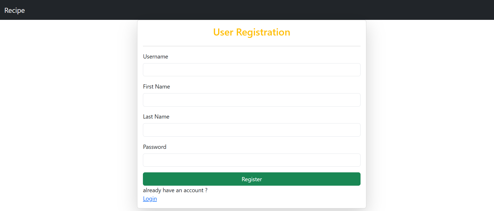

# Recipe-Project

    This project is a recipe management application where users can create, read, update, and delete (CRUD) 
    their recipes. 
    Users must register and log in to access the CRUD features.
    Without logging in, users will not be able to enter or interact with the recipe database.
    
     
    Features:

>Registration: New users can register an account to use the application.

>Login: Registered users can log in to access the app.

>CRUD Operations:

    Create: Add new recipes.
    Read: View recipes.
    Update: Edit existing recipes.
    Delete: Remove recipes.

> This is Registration /login Page:
User registration is unique

> Now you can add Recipe in this page:
added recipe with proper messages

> You can see all recipes that you added here if you want to delete specific recipe you can delete also.

> and also search recipes by their name:

> for update :

> after logout you can not re-enter dashboard page: 